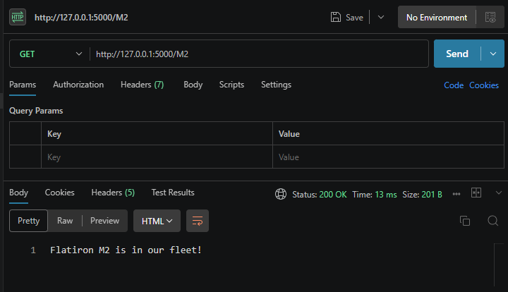

# Lab: Car Routes Lab

Welcome to the Flatiron Cars Flask application! This project sets up a lightweight Python web server using the Flask framework. The API allows users to view a welcome message and verify whether specific car models exist within the company's rental fleet.

## Overview

## 🚀 Features

### Home Route: 
Greets users with a welcoming header message.

### Dynamic Fleet Search: 
Checks if a requested vehicle model is currently available in the catalog.

### Smart Response Codes: 
Returns standard HTTP status codes (200 OK for success and 404 Not Found for missing vehicles).

## 🛠️ Tech Stack & RequirementsLanguage: 

Python 3.8+Framework: 
FlaskEnvironment Management: 
Pipenv

## 📥 Installation & Setup
Follow these steps to get your development environment configured properly:
1. Clone and Navigate to the Project FolderOpen your terminal and ensure you are in the root directory of the repository: bashcd python-flask-car-routes-lab
2. Activate the Virtual Environment
Enter the Pipenv shell to isolate your project dependencies:bashpipenv shell
3. Install Required DependenciesIf Flask or other packages are missing, download them directly into your virtual environment:bashpipenv install
4. 🏃 Running the ApplicationTo fire up the Flask development server, execute the application file directly:bashpython server/app.py
Your server will boot up and listen for requests at: http://127.0.0.1:5000/

